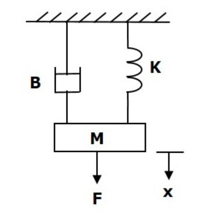
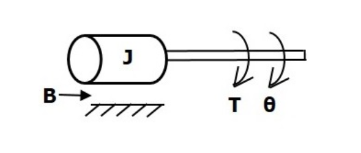
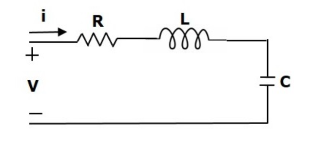
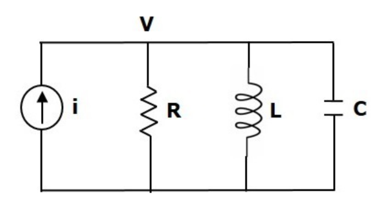

# Modeling
Modeling with mass, spring, dampening systems and resistor, inductor, capacitance systems.

# Linear Mechanical System

The sum of force equation for this system

$$F_{ext} = F_m + F_b + F_k$$

Newton's law $F_m = M*a$, Damping force $F_b = B*v$, Spring force (Hooke's law) $F_k = K*x$

$$F_{ext} = M\ddot{x} + B\dot{x} + Kx$$

In state space representation

$$\dot{x} = Ax + Bu$$

choosing state x with position x and velocity $\dot x$

$$x = \begin{bmatrix}x \\ \dot{x}\end{bmatrix}$$

Taking the derivative becomes

$$\dot{x} = \begin{bmatrix}\dot x \\ \ddot{x}\end{bmatrix}$$

Plugging in the force equation $\ddot{x} = (F_{ext} - Kx - B\dot{x})/M$

$$\dot{x} = 
\begin{bmatrix}0 & 1\\ -K/M & -B/M\end{bmatrix}
\begin{bmatrix}x \\ \dot{x}\end{bmatrix} + 
\begin{bmatrix}0 \\ 1/M\end{bmatrix}
\begin{bmatrix}F_{ext}\end{bmatrix}
$$

# Rotational Mechanical System

The sum of torque equation for this system

$$T_{ext} = T_j + T_b + T_k$$

Moment of inertia $T_j = J*\alpha$, Damping torque $T_b = B*\omega$, Spring torque $T_k = K*\theta$

$$T_{ext} = J\ddot{\theta} + B\dot{\theta} + K\theta$$

In state space representation

$$\dot{x} = Ax + Bu$$

choosing state x with angular position $\theta$ and angular velocity $\dot\theta$

$$x = \begin{bmatrix}\theta \\ \dot{\theta}\end{bmatrix}$$

Taking the derivative becomes

$$\dot{x} = \begin{bmatrix}\dot\theta \\ \ddot{\theta}\end{bmatrix}$$

Plugging in the torque equation $\ddot{\theta} = (T_{ext} - K\theta - B\dot{\theta})/J$

$$\dot{x} = 
\begin{bmatrix}0 & 1\\ -K/J & -B/J\end{bmatrix}
\begin{bmatrix}\theta \\ \dot{\theta}\end{bmatrix} + 
\begin{bmatrix}0 \\ 1/J\end{bmatrix}
\begin{bmatrix}T_{ext}\end{bmatrix}
$$

# Series RLC Circuit

The sum of voltage equation for this system

$$V_{ext} = V_r + V_l + V_c$$

Resistor voltage $V_r = R*i$, Inductor voltage $V_l = L*\frac{di}{dt}$, Capacitor voltage $V_c = \frac{1}{C}\int{i}dt, i = \frac{dq}{dt}$

$$V_{ext} = L\frac{di}{dt} + Ri + \frac{1}{C}\int{i}dt$$

$$V_{ext} = L\frac{d^{2}q}{dt^2} + R\frac{dq}{dt} + \frac{1}{C}q$$

In state space representation

$$\dot{x} = Ax + Bu$$

choosing state x with charge $q$ and change of charge $\dot q = i$

$$x = \begin{bmatrix}q \\ \dot{q}\end{bmatrix}$$

Taking the derivative becomes

$$\dot{x} = \begin{bmatrix}\dot q \\ \ddot{q}\end{bmatrix}$$

Plugging in the voltage equation $\ddot{q} = (V_{ext} - \frac{1}{C}q  - R\dot q)/L$

$$\dot{x} = 
\begin{bmatrix}0 & 1\\ -1/LC & -R/L\end{bmatrix}
\begin{bmatrix}q \\ \dot{q}\end{bmatrix} + 
\begin{bmatrix}0 \\ 1/L\end{bmatrix}
\begin{bmatrix}V_{ext}\end{bmatrix}
$$

# Parallel RLC Circuit

The sum of current equation for this system

$$I_{ext} = I_r + I_l + I_c$$

Resistor current $I_r = \frac{v}{R}$, Inductor current $I_l = \frac{1}{L}\int{v}dt$, Capacitor current $I_c = C\frac{dv}{dt}, v = \frac{d\psi}{dt}$

$$I_{ext} = C\frac{dv}{dt} + \frac{v}{R} + \frac{1}{L}\int{v}dt$$

$$I_{ext} = C\frac{d^{2}\psi}{dt^2} + \frac{1}{R}\frac{d\psi}{dt} + \frac{1}{L}\psi$$

In state space representation

$$\dot{x} = Ax + Bu$$

choosing state x with flux $\psi$ and change of flux $\dot\psi = v$

$$x = \begin{bmatrix}\psi \\ \dot{\psi}\end{bmatrix}$$

Taking the derivative becomes

$$\dot{x} = \begin{bmatrix}\dot \psi \\ \ddot{\psi}\end{bmatrix}$$

Plugging in the voltage equation $\ddot{\psi} = (I_{ext} - \frac{1}{L}\psi - \frac{1}{R}\dot\psi)/C$

$$\dot{x} = 
\begin{bmatrix}0 & 1\\ -1/LC & -1/RL\end{bmatrix}
\begin{bmatrix}\psi \\ \dot{\psi}\end{bmatrix} + 
\begin{bmatrix}0 \\ 1/C\end{bmatrix}
\begin{bmatrix}I_{ext}\end{bmatrix}
$$

# DC Motor Position
