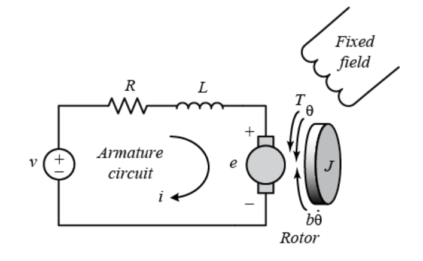

# Modeling
Modeling with mass, spring, dampening systems and resistor, inductor, capacitance systems.

# Linear Mechanical System

The sum of force equation for this system

$$F_{ext} = F_m + F_b + F_k$$

Newton's law $F_m = M*a$, Damping force $F_b = B*v$, Spring force (Hooke's law) $F_k = K*x$

$$F_{ext} = M\ddot{x} + B\dot{x} + Kx$$

In state space representation

$$\dot{x} = Ax + Bu$$

choosing state x with position x and velocity $\dot x$

$$x = \begin{bmatrix}x \\ \dot{x}\end{bmatrix}$$

Taking the derivative becomes

$$\dot{x} = \begin{bmatrix}\dot x \\ \ddot{x}\end{bmatrix}$$

Plugging in the force equation $\ddot{x} = (F_{ext} - Kx - B\dot{x})/M$

$$\dot{x} = 
\begin{bmatrix}0 & 1\\ -K/M & -B/M\end{bmatrix}
\begin{bmatrix}x \\ \dot{x}\end{bmatrix} + 
\begin{bmatrix}0 \\ 1/M\end{bmatrix}
\begin{bmatrix}F_{ext}\end{bmatrix}
$$

# Rotational Mechanical System

The sum of torque equation for this system

$$T_{ext} = T_j + T_b + T_k$$

Moment of inertia $T_j = J*\alpha$, Damping torque $T_b = B*\omega$, Spring torque $T_k = K*\theta$

$$T_{ext} = J\ddot{\theta} + B\dot{\theta} + K\theta$$

In state space representation

$$\dot{x} = Ax + Bu$$

choosing state x with angular position $\theta$ and angular velocity $\dot\theta$

$$x = \begin{bmatrix}\theta \\ \dot{\theta}\end{bmatrix}$$

Taking the derivative becomes

$$\dot{x} = \begin{bmatrix}\dot\theta \\ \ddot{\theta}\end{bmatrix}$$

Plugging in the torque equation $\ddot{\theta} = (T_{ext} - K\theta - B\dot{\theta})/J$

$$\dot{x} = 
\begin{bmatrix}0 & 1\\ -K/J & -B/J\end{bmatrix}
\begin{bmatrix}\theta \\ \dot{\theta}\end{bmatrix} + 
\begin{bmatrix}0 \\ 1/J\end{bmatrix}
\begin{bmatrix}T_{ext}\end{bmatrix}
$$

# Series RLC Circuit

The sum of voltage equation for this system

$$V_{ext} = V_r + V_l + V_c$$

Resistor voltage $V_r = R*i$, Inductor voltage $V_l = L*\frac{di}{dt}$, Capacitor voltage $V_c = \frac{1}{C}\int{i}dt, i = \frac{dq}{dt}$

$$V_{ext} = L\frac{di}{dt} + Ri + \frac{1}{C}\int{i}dt$$

$$V_{ext} = L\frac{d^{2}q}{dt^2} + R\frac{dq}{dt} + \frac{1}{C}q$$

In state space representation

$$\dot{x} = Ax + Bu$$

choosing state x with charge $q$ and change of charge $\dot q = i$

$$x = \begin{bmatrix}q \\ \dot{q}\end{bmatrix}$$

Taking the derivative becomes

$$\dot{x} = \begin{bmatrix}\dot q \\ \ddot{q}\end{bmatrix}$$

Plugging in the voltage equation $\ddot{q} = (V_{ext} - \frac{1}{C}q  - R\dot q)/L$

$$\dot{x} = 
\begin{bmatrix}0 & 1\\ -1/LC & -R/L\end{bmatrix}
\begin{bmatrix}q \\ \dot{q}\end{bmatrix} + 
\begin{bmatrix}0 \\ 1/L\end{bmatrix}
\begin{bmatrix}V_{ext}\end{bmatrix}
$$

# Parallel RLC Circuit

The sum of current equation for this system

$$I_{ext} = I_r + I_l + I_c$$

Resistor current $I_r = \frac{v}{R}$, Inductor current $I_l = \frac{1}{L}\int{v}dt$, Capacitor current $I_c = C\frac{dv}{dt}, v = \frac{d\psi}{dt}$

$$I_{ext} = C\frac{dv}{dt} + \frac{v}{R} + \frac{1}{L}\int{v}dt$$

$$I_{ext} = C\frac{d^{2}\psi}{dt^2} + \frac{1}{R}\frac{d\psi}{dt} + \frac{1}{L}\psi$$

In state space representation

$$\dot{x} = Ax + Bu$$

choosing state x with flux $\psi$ and change of flux $\dot\psi = v$

$$x = \begin{bmatrix}\psi \\ \dot{\psi}\end{bmatrix}$$

Taking the derivative becomes

$$\dot{x} = \begin{bmatrix}\dot \psi \\ \ddot{\psi}\end{bmatrix}$$

Plugging in the voltage equation $\ddot{\psi} = (I_{ext} - \frac{1}{L}\psi - \frac{1}{R}\dot\psi)/C$

$$\dot{x} = 
\begin{bmatrix}0 & 1\\ -1/LC & -1/RL\end{bmatrix}
\begin{bmatrix}\psi \\ \dot{\psi}\end{bmatrix} + 
\begin{bmatrix}0 \\ 1/C\end{bmatrix}
\begin{bmatrix}I_{ext}\end{bmatrix}
$$

# DC Motor Position

DC motor can be modeled with an electrical part and a rotational mechanical part. Using sum of forces.

$$T_{ext} = J\ddot\theta + b\dot\theta$$

Using Kirchhoff's voltage law.

$$V_{ext} = V_r + V_l + V_{emf}$$

DC motor is proportional to the armature current and the magnetic field. $T = K_t i$ The back emf is proportional to the angular velocity of the shaft. $V_{emf} = K_b \dot\theta$. $V_l = L \frac{di}{dt}$

Substituting the equations becomes

$$K_t i = J\ddot\theta + b\dot\theta$$

$$V_{ext} = Ri + L\frac{di}{dt} + K_b \dot\theta$$

Taking the Laplace transform

$$K_t I(s) = Js^2\theta(s) + bs\theta(s)$$

$$I(s) = \frac{Js^2\theta(s) + bs\theta(s)}{K_t}$$

$$V_{ext}(s) = RI(s) + LsI(s) + K_b s\theta(s)$$

$$(Ls + R)I(s) = V_{ext}(s) - K_b s\theta(s)$$

Substituting the electrical current into the mechanical toque equation becomes

$$(Ls + R)\frac{Js^2\theta(s) + bs\theta(s)}{K_t} + K_b s\theta(s) = V_{ext}(s)$$

$$\theta(s)[\frac{(Ls + R)(Js^2 + bs)}{K_t} + K_b s] = V_{ext}(s)$$

$$\theta(s)[\frac{(Ls + R)(Js^2 + bs)}{K_t} + \frac{K_t K_b s}{K_t}] = V_{ext}(s)$$

$$\frac{\theta(s)}{V_{ext}(s)} = \frac{K_t}{(Ls + R)(Js^2 + bs) + K_t K_b s}$$

Angular position transfer function becomes

$$\frac{\theta(s)}{V_{ext}(s)} = \frac{K_t}{s[(Ls + R)(Js + b) + K_t K_b]}$$

The transfer function for angular velocity would be angular position * s

$$\frac{\dot\theta(s)}{V_{ext}(s)} = \frac{K_t}{(Ls + R)(Js + b) + K_t K_b}$$

The state space equation

Choosing state

$$x = \begin{bmatrix}\theta \\ \dot\theta \\ i\end{bmatrix}$$

With the equations

$$\ddot\theta = \frac{-b\dot\theta + K_t i}{J}$$

$$\dot i = \frac{-K_b\dot\theta -Ri + V_{ext}}{L}$$

With the form

$$\dot x = Ax + Bu$$

$$y = Cx + Du$$

To become

$$
\begin{bmatrix}\dot\theta \\ \ddot\theta \\ \dot i\end{bmatrix} =
\begin{bmatrix}0 && 1 && 0 \\ 0 && -b/J && K_t/J \\ 0 && -K_b/L && -R/L\end{bmatrix}
\begin{bmatrix}\theta \\ \dot\theta \\ i\end{bmatrix} +
\begin{bmatrix}0 \\ 0 \\ 1/L\end{bmatrix}
\begin{bmatrix}V_{ext}\end{bmatrix}
$$

$$
y = 
\begin{bmatrix}1 && 0 && 0\end{bmatrix}
\begin{bmatrix}\theta \\ \dot\theta \\ i\end{bmatrix}
$$
