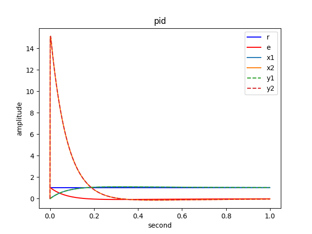

# Servo Controller
Servo control requires command tracking such as angular position, angular velocity. angular acceleration, and torque. Two common controllers are PID and PIV.

# Model
The sum of torque on a simplified servo mechanical motor

$$T_{ext} = T_j + T_b$$

Motor torque is proportional to current.

$$T = K_t i$$

Substituting into the equation

$$K_t i = J\ddot\theta + b\dot\theta$$

Taking the Laplace transform

$$K_t I(s) = Js^2\theta(s) + bs\theta(s)$$

The transfer funtion becomes

$$\frac{\theta(s)}{I(s)} = \frac{K_t}{s(Js + b)}$$

In state space, using the equation

$$\ddot\theta = \frac{-b\dot\theta + K_t i}{J}$$

Choosing state

$$x = \begin{bmatrix}\theta \\ \dot\theta\end{bmatrix}$$

Into the form

$$\dot x = Ax + Bu$$

In discrete form

$$
\frac{x[k+1] - x[k]}{dt} = 
\begin{bmatrix}0 && 1 \\ 0 && -b/J\end{bmatrix}
\begin{bmatrix}\theta \\ \dot\theta\end{bmatrix} +
\begin{bmatrix}0 \\ K_t/J\end{bmatrix}
\begin{bmatrix}i\end{bmatrix}
$$

$$
x[k+1] - x[k] =
\begin{bmatrix}0 && dt \\ 0 && -dt*b/J\end{bmatrix}
\begin{bmatrix}\theta \\ \dot\theta\end{bmatrix} +
\begin{bmatrix}0 \\ dt*K_t/J\end{bmatrix}
\begin{bmatrix}i\end{bmatrix}
$$

$$
x[k+1] = 
\begin{bmatrix}1 && dt \\ 0 && 1-dt*b/J\end{bmatrix}
\begin{bmatrix}\theta \\ \dot\theta\end{bmatrix} +
\begin{bmatrix}0 \\ dt*K_t/J\end{bmatrix}
\begin{bmatrix}i\end{bmatrix}
$$

# Proportional Integral Derivative Controller

Assuming $G(s) = 1$\
Motor inertia $J = 50e-6 kg*m^2$\
Motor damping $b = 0.1e-3 Nm/(rad/sec)$\
Motor torque constant $K_t = 0.6 Nm/A$

Using Ziegler and Nichols method to tune\
$K_p = 0.6K_o, Nm/rad$\
$K_i = 2f_o K_p, Nm/(rad*sec)$\
$K_d = K_p/8f_o, Nm(rad/sec)$

With Ko at a high enough gain to cause oscillation and fo set to the oscillating frequency.

Using Ko = 5e-4\
\
Can see the settling time around 6 seconds.

Using Ko = 5e-3\
\
Can see the settling time around 1 second and the velocity spikes higher than before.

Using Ko = 5e-2\
\
Can see the settling time around 0.25 second and the velocity spikes extremely high.

# Proportional Integral Velocity Controller

Assuming $G(s) = 1$\
Motor inertia $J = 50e-6 kg*m^2$\
Motor damping $b = 0.1e-3 Nm/(rad/sec)$\
Motor torque constant $K_t = 0.6 Nm/A$

There are 2 modes when using PIV controller. The position mode which uses both inner velocity loop and outer position loop to track reference position while velocity is set to 0. The velocity mode which sets Kp = 0 to turn off the outer position loop and only use the inner velocity loop to track reference velocity.

To tune PIV only 2 parameters are used, the bandwidth of the system and the damping ratio (zeta)\
$K_p = \frac{2\pi BW}{2\zeta + 1}, 1/sec$\
$K_i = J(2\zeta + 1)(2\pi BW)^2, Nm/rad$\
$K_d = J(2\zeta + 1)(2\pi BW)-b, Nm/(rad/sec)$

Using BW = 20, zeta = 1\
\
Can see the settling time around 0.1 second.

Using BW = 10, zeta = 1\
\
Can see the settling time around 0.2 second.

Using BW = 5, zeta = 1\

Can see the settling time around 0.4 second.

Using BW = 20, zeta = 1\
\
Can see the settling time around 0.1 second.

Using BW = 20, zeta = 1.5\
\
Can see that overdamping causes the system to response slower, with the settling time around 0.2 second.

Using BW = 20, zeta = 0.5\
\
Can see that underdamping causes the system to oscillate, while the settling time is still around 0.1 second.

# References
[PIV Parker](https://www.parkermotion.com/whitepages/ServoFundamentals.pdf)
